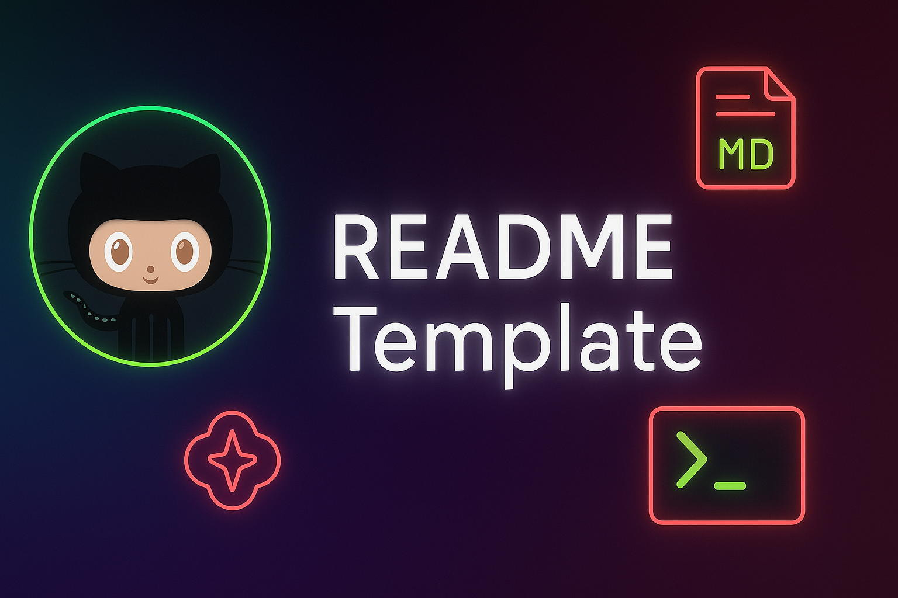

<h1 id="Heading" align="center">Readme Template</h1>

<p align="center">

</p>

## Support This Project Designed By: The-Py-King

<p align="center">If you found this project helpful, consider supporting me in creating more useful projects like this:</p>

<div align="center">

[](https://coff.ee/thepyking)
[](https://PayPal.Me/ThePyKing)

</div>

<p align="center">Your support helps maintain and improve this project. Thank you! 🙏</p>

---

## Table of Contents

- [Overview](#overview)
- [Features](#features)
- [Installation](#installation)
- [Usage](#usage)
- [API Reference](#api-reference)
- [Configuration](#configuration)
- [Contributing](#contributing)
- [Testing](#testing)
- [Deployment](#deployment)
- [FAQ](#faq)
- [Changelog](#changelog)
- [License](#license)
- [Acknowledgments](#acknowledgments)
- [Contact](#contact)

## Overview
This README template provides a structured foundation for documenting your projects with clarity and professionalism. Whether you're building a small utility or a large-scale application, a well-crafted README is often the first impression users and contributors will have of your work.

Provide a more detailed explanation of your project. What problem does it solve? What makes it unique? Who is your target audience?

**P.S.** Keep in mind that no template can cover everything. There will be some headings, subheadings and processes missing depending on the project, language and installations. This is just a template to help guide you on your starting point. 

### <u>Why This Project?</u>

Explain the motivation behind creating this project. What gap does it fill?

### <u>Key Benefits</u>

- Benefit 1: Brief explanation
- Benefit 2: Brief explanation  
- Benefit 3: Brief explanation

## Features

- ✨ **Feature 1**: Description of what this feature does
- 🚀 **Feature 2**: Description of what this feature does
- 🔧 **Feature 3**: Description of what this feature does
- 📱 **Feature 4**: Description of what this feature does

## Installation

### <u>Prerequisites</u>

List any dependencies or requirements needed before installation:

- Node.js (version X.X or higher)
- Python 3.8+
- Git
- Other requirements

### <u>Quick Install</u>

```bash
# Clone the repository
git clone https://github.com/yourusername/your-project-name.git

# Navigate to project directory
cd your-project-name

# Install dependencies
npm install
# or
pip install -r requirements.txt
```

### <u>Alternative Installation Methods</u>

#### Using Package Manager
```bash
npm install your-package-name
# or
pip install your-package-name
```

#### Docker Installation
```bash
docker pull yourusername/your-project-name
docker run -p 8080:8080 yourusername/your-project-name
```

## Usage

### <u>Basic Usage</u>

Show the most common use case with a simple example:

```javascript
// Example code block
const yourProject = require('your-project-name');

yourProject.doSomething({
  option1: 'value1',
  option2: 'value2'
});
```

### <u>Advanced Usage</u>

Provide more complex examples:

```python
# Python example
from your_project import YourClass

# Create an instance
instance = YourClass(config='path/to/config.yml')

# Use advanced features
result = instance.advanced_method(
    parameter1='value1',
    parameter2='value2'
)
```

### <u>Command Line Interface</u>

If your project has a CLI:

```bash
# Basic command
your-project-name --help

# Common usage patterns
your-project-name init --template=basic
your-project-name build --output=dist/
your-project-name deploy --env=production
```

## API Reference

### <u>Core Functions</u>

#### `functionName(parameter1, parameter2)`

**Description**: Brief description of what this function does.

**Parameters**:
- `parameter1` (string): Description of parameter
- `parameter2` (object, optional): Description of parameter

**Returns**: Description of return value

**Example**:
```javascript
const result = functionName('example', { option: true });
```

#### `anotherFunction(options)`

**Description**: Another function description.

**Parameters**:
- `options` (object): Configuration options
  - `options.prop1` (string): Description
  - `options.prop2` (boolean): Description

**Returns**: Description of return value

### <u>Error Handling</u>

Common errors and how to handle them:

<table width="100%">
<thead>
  <tr>
    <th>Error Code</th>
    <th>Description</th>
    <th>Solution</th>
  </tr>
</thead>
<tbody>
  <tr>
    <td><code>ERR001</code></td>
    <td>Configuration file not found</td>
    <td>Check file path and permissions</td>
  </tr>
  <tr>
    <td><code>ERR002</code></td>
    <td>Invalid API key</td>
    <td>Verify API key in settings</td>
  </tr>
</tbody>
</table>

## Configuration

### <u>Environment Variables</u>

<table width="100%">
<thead>
  <tr>
    <th>Variable</th>
    <th>Description</th>
    <th>Default</th>
    <th>Required</th>
  </tr>
</thead>
<tbody>
  <tr>
    <td><code>API_KEY</code></td>
    <td>Your API key</td>
    <td>-</td>
    <td>Yes</td>
  </tr>
  <tr>
    <td><code>PORT</code></td>
    <td>Server port</td>
    <td><code>3000</code></td>
    <td>No</td>
  </tr>
  <tr>
    <td><code>NODE_ENV</code></td>
    <td>Environment mode</td>
    <td><code>development</code></td>
    <td>No</td>
  </tr>
</tbody>
</table>

### <u>Configuration File</u>

Create a `config.yml` file in your project root:

```yaml
# config.yml
database:
  host: localhost
  port: 5432
  name: your_database

api:
  key: your_api_key
  timeout: 30000

features:
  enable_logging: true
  enable_cache: false
```

## Contributing

We welcome contributions! Please see our [Contributing Guidelines](CONTRIBUTING.md) for details.

### <u>Quick Start for Contributors</u>

1. Fork the repository
2. Create a feature branch (`git checkout -b feature/amazing-feature`)
3. Make your changes
4. Add tests for your changes
5. Ensure all tests pass (`npm test`)
6. Commit your changes (`git commit -m 'Add amazing feature'`)
7. Push to the branch (`git push origin feature/amazing-feature`)
8. Open a Pull Request

### <u>Development Setup</u>

```bash
# Clone your fork
git clone https://github.com/your-username/your-project-name.git

# Install development dependencies
npm install --dev

# Run in development mode
npm run dev
```

### <u>Code Style</u>

We use [ESLint](https://eslint.org/) and [Prettier](https://prettier.io/) for code formatting. Run:

```bash
npm run lint
npm run format
```

## Testing

### <u>Running Tests</u>

```bash
# Run all tests
npm test

# Run tests with coverage
npm run test:coverage

# Run tests in watch mode
npm run test:watch
```

### <u>Test Structure</u>

Tests are located in the `tests/` directory and follow this structure:

```
tests/
├── unit/           # Unit tests
├── integration/    # Integration tests
├── fixtures/       # Test data
└── helpers/        # Test utilities
```

## Deployment

### <u>Production Build</u>

```bash
# Build for production
npm run build

# Start production server
npm start
```

### <u>Docker Deployment</u>

```dockerfile
# Dockerfile example
FROM node:16-alpine
WORKDIR /app
COPY package*.json ./
RUN npm ci --only=production
COPY . .
EXPOSE 3000
CMD ["npm", "start"]
```

### <u>Environment Setup</u>

1. Set up your production environment variables
2. Configure your database
3. Set up monitoring and logging
4. Configure SSL certificates

## FAQ

### <u>Example Questions</u>

**Q: How do I update to the latest version?**<br>
A: Run `npm update your-project-name` or check our [releases page](https://github.com/yourusername/your-project-name/releases).

**Q: Can I use this in commercial projects?**<br>
A: Yes, this project is licensed under MIT. See the [License](#license) section.

**Q: How do I report a bug?**<br>
A: Please create an issue on our [GitHub Issues page](https://github.com/yourusername/your-project-name/issues).

## Changelog

### <u>[V1.0.0] - 2025-XX-XX</u>
#### Added
- Initial release
- Core functionality
- Documentation

#### Changed
- N/A

#### Fixed
- N/A

For a complete changelog, see [CHANGELOG.md](CHANGELOG.md).

## License

This project is licensed under the MIT License - see the [LICENSE](LICENSE.md) file for details.

### <u>Third-Party Licenses</u>

This project uses the following open-source packages:

- [Package Name](https://github.com/package/name) - MIT License
- [Another Package](https://github.com/another/package) - Apache 2.0 License

## Acknowledgments

- Thanks to [Contributor Name](https://github.com/contributor) for their amazing work on feature X, Y, Z
- Inspired by [Project Name](https://github.com/project/name)
- Built with [Technology/Framework Name](https://technology-website.com)
- Special thanks to the open-source community

## Contact

- **Author**: Your Name
- **Email**: your.email@example.com
- **GitHub**: [@yourusername](https://github.com/yourusername)
- **Website**: [yourwebsite.com](https://yourwebsite.com)
- **Twitter**: [@yourhandle](https://twitter.com/yourhandle)

### <u>Support</u>

- 📧 Email: support@yourproject.com
- 💬 Discord: [Join our community](https://discord.gg/yourserver)
- 📖 Documentation: [docs.yourproject.com](https://docs.yourproject.com)
- 🐛 Issues: [GitHub Issues](https://github.com/yourusername/your-project-name/issues)

---

<div align="center">

[**⬆ Back to Top**](#Heading)

<p>Made with ❤️ and ☕ by <a href="https://github.com/The-Py-King">Developer Name</a></p>
  <p>
<a href="https://twitter.com/username">🐦 Twitter</a> |
    <a href="https://dev.to/username">📝 Blog</a> |
    <a href="https://linkedin.com/in/username">💼 LinkedIn</a>
</div>

<!-- 
TEMPLATE INSTRUCTIONS:
1. Replace "Project Name" with your actual project name
2. Update all placeholder URLs (yourusername, your-project-name, etc.)
3. Replace example code with your actual usage examples
4. Update the badges with real status indicators
5. Remove sections that don't apply to your project
6. Add project-specific sections as needed
7. Update contact information
8. Replace placeholder dates in changelog
9. Customize the tech stack and dependencies
10. Add real screenshots or demos if applicable

OPTIONAL SECTIONS TO CONSIDER ADDING:
- Screenshots/Demo section
- Roadmap
- Performance benchmarks
- Security considerations
- Architecture overview
- Troubleshooting guide
- Migration guides
- Sponsors section
-->
